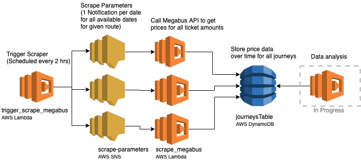

# Megabus Demand Analysis
A simple program to regularly get data from Megabus to understand demand (currently only for Edinburgh to London route).
Deployed in AWS using the Serverless framework. 
Uses Sentry for error handling.



## Setup
###### Only necessary if you want to deploy new instances of functions and resources from your machine and run them from there. Otherwise you can access and trigger them from the AWS console
Install [Serverless](https://serverless.com/framework/docs/getting-started/)
```
npm install serverless
```
Make sure your [AWS credentials](https://serverless.com/framework/docs/providers/aws/cli-reference/config-credentials/#aws---config-credentials) are set up properly and you have a vars.yml file in the same directory with the following contents
```
AWS_ACCOUNT_ID: [your-aws-account-num]
SENTRY_KEY: [your-sentry-key]
SENTRY_PROJECT: [your-sentry-project-id]
```
Deploy the service
```
sls deploy
```

## To Run
Trigger scrape for all dates for Edinburgh to London route
```
sls invoke -f trigger_scrape_megabus
```
Or trigger the function from lambda in the AWS console

Scrape for a specific date by publishing a message to SNS topic scrape-params in the AWS console. Example message:
```
{"origin": 56, "destination": 34, "date": "2019-10-21"}
```

Go to journeysTable DynamoDB table in the AWS console and click on an item to see the new data

Or use the journey_data endpoint to retrieve data from the database, using the journey id like so
```
https://ucrun35kqk.execute-api.us-east-1.amazonaws.com/dev/journey?journey_id=30622617
```